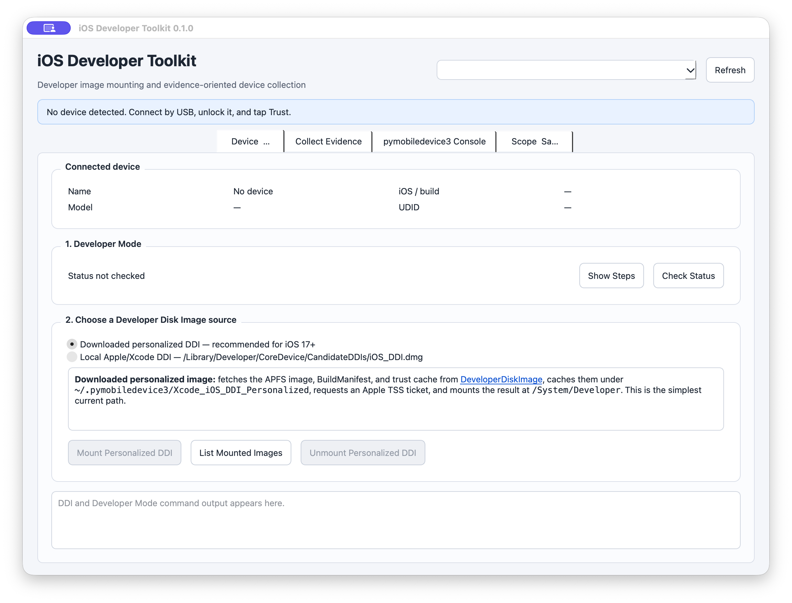
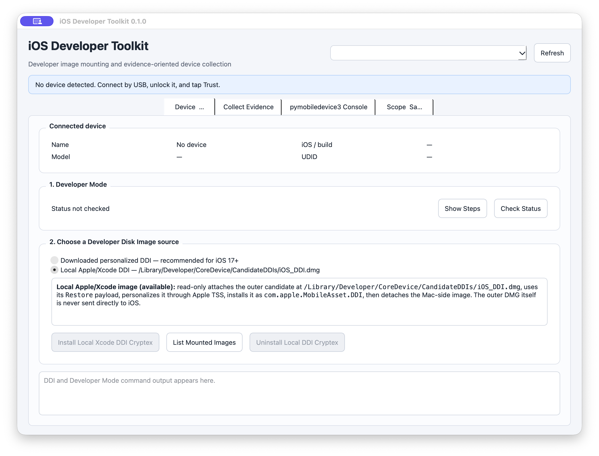
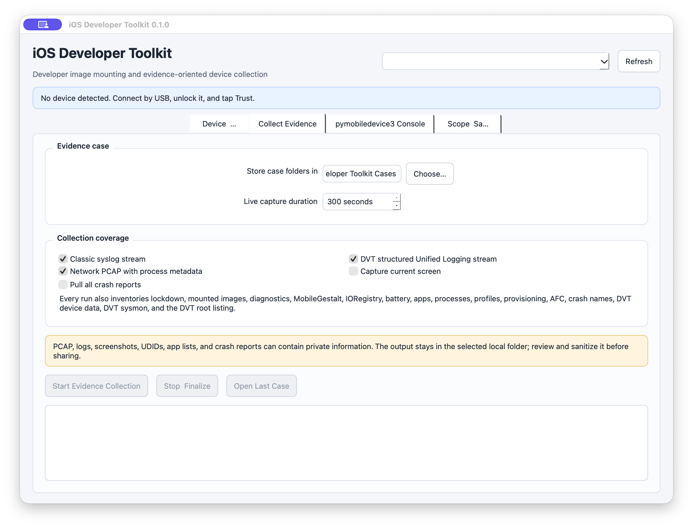
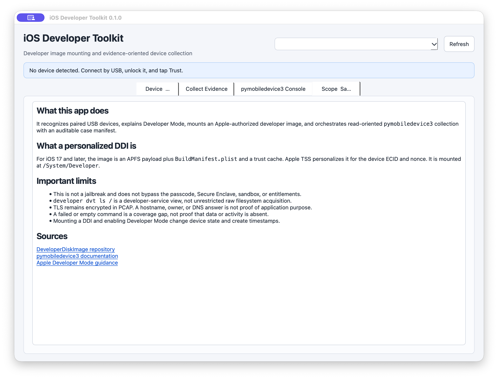

# iOS Developer Toolkit

### Developer Disk Image mounting and evidence-oriented iPhone/iPad diagnostics from macOS


> **Scope:** iOS Developer Toolkit is a macOS front end for authorized Developer Disk Image (DDI) operations and `pymobiledevice3` collection. It detects trusted USB devices, explains Developer Mode, offers two modern personalized-image paths, records diagnostic snapshots and timed streams, and preserves an auditable local case folder.



## Contents

- [What it does](#what-it-does)
- [What a DDI is](#what-a-ddi-is)
- [Personalized DDI vs. local Xcode DDI](#personalized-ddi-vs-local-xcode-ddi)
- [Requirements](#requirements)
- [Install and launch](#install-and-launch)
- [Complete walkthrough](#complete-walkthrough)
- [Evidence collected](#evidence-collected)
- [Built-in pymobiledevice3 console](#built-in-pymobiledevice3-console)
- [Command-line collector](#command-line-collector)
- [Interpretation and safety](#interpretation-and-safety)
- [Troubleshooting](#troubleshooting)
- [Development and verification](#development-and-verification)
- [Sources and credits](#sources-and-credits)

## What it does

The app brings one connected-device workflow into a small GUI:

- polls `pymobiledevice3 usbmux list` and recognizes paired iPhones and iPads;
- shows the selected device name, iOS/build version, model, and UDID;
- provides the exact on-device Developer Mode sequence;
- queries Developer Mode state;
- mounts a downloaded personalized Developer Disk Image;
- installs the local Apple/Xcode DDI as a personalized Cryptex;
- lists and removes the corresponding mounted image;
- runs a repeatable evidence collector with complete command output;
- streams classic syslog, DVT structured Unified Logging, and iOS PCAP;
- offers a constrained `pymobiledevice3` command console;
- writes a manifest and SHA-256 inventory for every case.

### Direct capability vs. interpretation

| Type | What the toolkit establishes |
|---|---|
| Direct capability | A trusted USB device is visible to `usbmux` and can be selected explicitly. |
| Direct capability | A personalized developer image can expose Apple developer services at `/System/Developer`. |
| Direct capability | The collector can request documented lockdown, diagnostics, AFC, crash, DVT, logging, and PCAP services. |
| Direct evidence | Each command, time, exit code, output path, package version, and coverage gap is recorded in `manifest.json`. |
| Interpretation boundary | A DVT root listing is a developer-service view, not an unrestricted raw-filesystem image. |
| Interpretation boundary | A process, profile, hostname, or endpoint is an observation—not proof of compromise or purpose. |

## Architecture

```mermaid
flowchart TB
    Device[iPhone or iPad]
    USB[Trusted USB pairing]
    Mode[Developer Mode]

    subgraph Host[macOS host]
        GUI[PySide6 GUI]
        PMD[pymobiledevice3]
        Repo[DeveloperDiskImage payload]
        Xcode[Local Xcode Candidate DDI]
        Case[Timestamped evidence case]
    end

    TSS[Apple TSS personalization]
    Dev[/System/Developer]

    Device <--> USB <--> GUI
    GUI --> PMD
    GUI --> Repo
    GUI --> Xcode
    Repo --> TSS
    Xcode --> TSS
    TSS --> Dev
    Mode --> Dev
    PMD --> Case
```

The GUI never invokes user-entered commands through a shell. It passes parsed arguments directly to the project-local `pymobiledevice3` executable.

## What a DDI is

A Developer Disk Image supplies device-side services used by development and diagnostic tools. Mounting it expands the services available through the device's development interfaces; it does not replace iOS or grant unrestricted access.

There are two generations:

| Device generation | Image form | Toolkit behavior |
|---|---|---|
| iOS below 17 | `DeveloperDiskImage.dmg` plus `.signature` for a matching iOS version | Supported by upstream `pymobiledevice3`; this GUI is centered on the modern workflow. |
| iOS 17 and later | APFS image, `BuildManifest.plist`, and trust cache personalized for a device | Downloaded and mounted, or extracted from the local Xcode candidate and installed as a Cryptex. |

For a modern image, Apple TSS signs a personalization request using device-specific identifiers and a nonce. The resulting developer image is mounted at `/System/Developer`. The ticket does not turn the DDI into a jailbreak and does not bypass the passcode, Secure Enclave, sandbox, code-signing policy, or application entitlements.

## Personalized DDI vs. local Xcode DDI

The app deliberately exposes both supported modern paths.

| Choice | Source | Host network activity | Device result | Removal action |
|---|---|---|---|---|
| **Downloaded personalized DDI** | [`doronz88/DeveloperDiskImage`](https://github.com/doronz88/DeveloperDiskImage) through `pymobiledevice3 mounter auto-mount` | Downloads the APFS image, build manifest, and trust cache when the cache is missing or stale; normally contacts Apple TSS | Personalized image mounted at `/System/Developer` | `mounter umount-personalized` |
| **Local Apple/Xcode DDI** | `/Library/Developer/CoreDevice/CandidateDDIs/iOS_DDI.dmg` | No GitHub payload download; normally contacts Apple TSS | Local `Restore` payload installed as `com.apple.MobileAsset.DDI` through `cryptexd` | `cryptex uninstall com.apple.MobileAsset.DDI` |

### Downloaded personalized path

The upstream image repository publishes fixed payload names for the personalized mounter variant: `Image.dmg`, `BuildManifest.plist`, and `Image.dmg.trustcache`. `pymobiledevice3` caches these under:

```text
~/.pymobiledevice3/Xcode_iOS_DDI_Personalized/
```

It asks the device for personalization identifiers and a nonce, obtains or reuses an Apple personalization manifest, uploads the image and trust cache, and mounts the result.

### Local Apple/Xcode path



The Xcode candidate path is an **outer container**, not the image uploaded directly to iOS. The toolkit:

1. verifies that `/Library/Developer/CoreDevice/CandidateDDIs/iOS_DDI.dmg` exists;
2. attaches it on the Mac with `hdiutil` using `-readonly -nobrowse -noautoopen`;
3. verifies `Restore/BuildManifest.plist` inside the mounted container;
4. passes that `Restore` directory to `pymobiledevice3 cryptex auto-install --restore-dir`;
5. lets Apple TSS personalize the payload for the selected device;
6. detaches the temporary Mac-side image even when installation fails.

This path is useful when Xcode/CoreDevice has already installed a compatible candidate. The GUI reports whether the expected local file is present before a device operation begins.

## Requirements

- macOS 13 or later is recommended.
- Python 3.10 or later.
- A data-capable USB cable.
- An unlocked iPhone or iPad that trusts the Mac.
- Developer Mode enabled for DDI/DVT operations.
- Internet access for Apple TSS personalization.
- Internet access to GitHub only when the downloaded personalized path needs to refresh its cache.
- Xcode/CoreDevice candidate DDI only when using the local Apple/Xcode path.

No dependency is installed globally. The launcher creates a project-local visible `IOSDeveloperToolkit/venv/` because hidden `.venv/` directories in File Provider-managed folders can mark Qt's Cocoa plugin hidden and prevent the GUI from launching.

## Install and launch

Clone the repository and run the project launcher:

```bash
git clone https://github.com/hideouts-io/iOS-System-Research.git
cd iOS-System-Research
./script/build_and_run.sh
```

The launcher:

1. creates `IOSDeveloperToolkit/venv/` when needed;
2. installs the pinned package and dependencies into that environment;
3. stages `IOSDeveloperToolkit/dist/iOS Developer Toolkit.app`;
4. opens the staged app.

The generated `venv/` and `dist/` directories stay outside version control. The v0.1.0 GitHub release is a source release; build the local wrapper with the command above.

Useful launch modes:

```bash
./script/build_and_run.sh --verify
./script/build_and_run.sh --debug
./script/build_and_run.sh --logs
./script/build_and_run.sh --telemetry
```

`--verify` waits for launch and proves the process remains alive. The logging modes stream host-side macOS logs; they are separate from the iPhone logging streams collected by the app.

## Complete walkthrough

### 1. Connect and trust the device

1. Connect the iPhone or iPad directly by USB.
2. Unlock it.
3. Tap **Trust** on the device if prompted and enter the device passcode.
4. Open the app and click **Refresh** if the device does not appear automatically.
5. If more than one trusted device is present, select the intended target from the menu before mounting or collecting.

The header remains explicit when no device is available, and device-changing buttons stay disabled.

### 2. Enable Developer Mode

Click **Show Steps** in the **Developer Mode** section.


On the iPhone or iPad:

1. Open **Settings → Privacy & Security → Developer Mode**.
2. Turn Developer Mode on.
3. Tap **Restart**.
4. After restart, unlock the device, tap **Turn On** or **Enable**, and enter the device passcode.
5. Reconnect and trust the Mac again if iOS asks.

If the setting is absent, first initiate pairing in Xcode under **Window → Devices and Simulators**, then return to Settings. Apple documents that Developer Mode appears after pairing is initiated or the device was previously paired.

Back in the toolkit, click **Check Status**. The app runs:

```bash
pymobiledevice3 mounter query-developer-mode-status
```

### 3. Choose and mount a DDI

Choose exactly one path:

- **Downloaded personalized DDI** for the simplest current iOS 17+ workflow.
- **Local Apple/Xcode DDI** when the candidate image exists and you prefer Xcode's local payload.

Review the confirmation dialog before proceeding. Both actions change device state and normally create network requests and timestamps.

After completion, click **List Mounted Images**. The app uses `mounter list` for the downloaded path and `cryptex list` for the local path. Treat a successful completion and an expected mounted entry as the verification pair.

### 4. Configure evidence collection

Open **Collect Evidence**.



1. Choose the parent directory for case folders.
2. Set a live-stream duration between 10 and 3,600 seconds.
3. Select any timed streams:
   - classic syslog;
   - DVT structured Unified Logging;
   - network PCAP with process metadata.
4. Optionally request the current device screenshot or a full crash-report pull.
5. Click **Start Evidence Collection** and review the privacy confirmation.

Snapshot commands run first. Each failing command is retried once and saved with a complete command log. Timed streams begin only after the required target inventory succeeds. **Stop & Finalize** requests a clean stop, writes the manifest, and hashes the artifacts already acquired.

### 5. Review the case

Click **Open Last Case**, then begin with:

```text
manifest.json
SHA256SUMS.txt
```

`manifest.json` records the target UDID, application and dependency versions, requested duration, start/end times, every command, attempt count, exit code, status, output path, and interpretation limits. A partial case is intentionally retained; a failed or empty command is a coverage gap, not evidence that the underlying data is absent.

### 6. Remove the developer image

Return to **Device & DDI** and use the removal button matching the path you installed:

- **Unmount Personalized DDI**, or
- **Uninstall Local DDI Cryptex**.

If Developer Mode is no longer needed, turn it off under **Settings → Privacy & Security → Developer Mode** and restart the device.

## Evidence collected

Every normal run requests these snapshots:

| Artifact | `pymobiledevice3` arguments | Purpose |
|---|---|---|
| USB inventory | `usbmux list` | Confirms the selected UDID remains connected. |
| Lockdown information | `lockdown info` | Device identity, version, build, and pairing-visible properties. |
| Mounted images | `mounter list` | Personalized image state. |
| Cryptex inventory | `cryptex list` | Installed Cryptex state. |
| Diagnostics | `diagnostics info` | Diagnostics-service information. |
| MobileGestalt | `diagnostics mg` | Values exposed through the known MobileGestalt query set. |
| IORegistry | `diagnostics ioregistry` | Device IORegistry data exposed by the diagnostics service. |
| Battery | `diagnostics battery single` | Point-in-time battery data. |
| Applications | `apps list` | Installed-application inventory visible to the service. |
| Processes | `processes ps` | Diagnostics process inventory. |
| Profiles | `profile list` | Installed configuration-profile inventory. |
| Provisioning | `provision list` | Installed provisioning-profile inventory. |
| Crash names | `crash ls` | Crash-report inventory. |
| AFC root | `afc ls /` | Media/AFC root listing, not the raw iOS root. |
| DVT device data | `developer dvt device-information` | Extended developer-service information. |
| DVT processes | `developer dvt sysmon process single` | Detailed point-in-time process data. |
| DVT filesystem | `developer dvt ls /` | DVT developer-service root view. |

Optional snapshots:

- `developer dvt screenshot artifacts/screen.png`
- `crash pull artifacts/crashes`

Optional timed streams:

- `syslog live`
- `developer dvt oslog`
- `pcap --out streams/network.pcap`

### Case layout

```text
ios-case-YYYYMMDDTHHMMSSZ-<UDID suffix>/
├── artifacts/
│   ├── crashes/                         # optional
│   └── screen.png                       # optional
├── snapshots/
│   ├── apps.json
│   ├── battery.json
│   ├── dvt-device-information.json
│   ├── dvt-root-listing.txt
│   ├── dvt-sysmon-processes.txt
│   ├── lockdown-info.json
│   ├── profiles.json
│   └── ...
├── streams/
│   ├── dvt-oslog.txt                    # optional
│   ├── network.pcap                     # optional
│   ├── pcap-metadata.txt                # optional
│   └── syslog.txt                       # optional
├── manifest.json
└── SHA256SUMS.txt
```

Each snapshot also has a neighboring `.command.log` containing all attempts and semantic-validation errors. `SHA256SUMS.txt` hashes every collected file except itself.

## Built-in pymobiledevice3 console


The console accepts **arguments only**, with or without a leading `pymobiledevice3`. It uses `shlex` parsing and direct process execution, so shell operators, command substitution, and pipelines are not evaluated by a shell.

Included presets cover:

- DVT device information;
- DVT root listing;
- detailed DVT process snapshot;
- DVT Unified Logging;
- classic syslog;
- installed apps;
- crash-report inventory;
- mounted images;
- network capture.

Known read-oriented command prefixes run normally. Any command outside that allowlist displays the exact command and requires a second confirmation because it may change device or host state. The allowlist is a guardrail, not a claim that every read operation is forensically neutral; service access and DDI use can still create timestamps and logs.

## Command-line collector

The same evidence engine can run without the GUI:

```bash
IOSDeveloperToolkit/venv/bin/ios-developer-collect \
  --udid DEVICE_UDID \
  --output-root "$HOME/Documents/iOS Developer Toolkit Cases" \
  --duration 300 \
  --include-syslog \
  --include-oslog \
  --include-pcap
```

Optional switches:

```text
--include-screenshot
--include-crash-pull
```

Exit status `0` means the requested collection completed, `2` means the case was finalized with optional coverage gaps, and `1` means a fatal or required-command failure occurred. In all cases where a case directory was created, review the retained manifest and outputs rather than relying only on the exit status.

## Interpretation and safety



- Use the toolkit only on devices you own or are authorized to examine.
- A DDI is not a jailbreak, exploit, passcode bypass, or Secure Enclave bypass.
- Developer Mode and DDI operations change device state. For evidence-sensitive work, preserve a backup or sysdiagnose first and record the time of each action.
- `developer dvt ls /` is not unrestricted raw-filesystem acquisition.
- AFC exposes its service-defined media view, not all protected app containers.
- PCAP does not decrypt TLS, QUIC, VPN, Private Relay, encrypted DNS, or application-layer encryption.
- Process metadata, ports, DNS names, TLS names, and IP ownership are attribution clues, not proof of application purpose or malicious behavior.
- Profiles, provisioning records, apps, processes, crashes, and retained strings show possible configuration or history; corroborate current activity separately.
- Empty output can mean unsupported service, permission limits, retention limits, version mismatch, or collection failure.
- Logs, PCAPs, screenshots, UDIDs, app inventories, profile data, and crash reports may contain sensitive information. Keep case folders out of Git and sanitize before sharing.

## Troubleshooting

| Symptom | Check |
|---|---|
| No device appears | Use a data cable, unlock the device, tap **Trust**, and click **Refresh**. Verify with `IOSDeveloperToolkit/venv/bin/pymobiledevice3 usbmux list`. |
| Developer Mode is missing | Initiate pairing in Xcode **Window → Devices and Simulators**, then check **Settings → Privacy & Security** again. |
| Developer Mode query fails | Keep the device unlocked, reconnect it, and confirm the selected UDID still appears in `usbmux list`. |
| DDI says Developer Mode is disabled | Complete the restart and post-restart **Enable/Turn On** confirmation on the device. |
| Downloaded image fails | Confirm GitHub and Apple TSS connectivity, review the exact output, and update only after checking compatibility with the pinned release. |
| Local Xcode option is unavailable | Verify `/Library/Developer/CoreDevice/CandidateDDIs/iOS_DDI.dmg`; install or update Xcode/CoreDevice if the file is absent. |
| Image is already mounted | Use **List Mounted Images**; do not repeatedly mount. Remove only the matching personalized/Cryptex path. |
| DVT commands fail after a mount | Re-check Developer Mode, mounted state, pairing, and whether the current iOS/pymobiledevice3 combination supports that service. |
| PCAP is empty or ends early | Keep the device connected and active; review `pcap-metadata.txt`, `manifest.json`, and the stream's process exit status. |
| Qt reports that Cocoa cannot initialize | Remove the generated hidden `.venv/` if present and relaunch. v0.1.0 uses visible `IOSDeveloperToolkit/venv/` to prevent hidden Qt plugins. |
| Collection is partial | This is preserved intentionally. Review failed entries and `.command.log` files, then rerun only after correcting the specific service or connectivity error. |

## Development and verification

Install into the project environment through the launcher, then run:

```bash
IOSDeveloperToolkit/venv/bin/python -m unittest discover \
  -s IOSDeveloperToolkit/tests \
  -p 'test_*.py'

IOSDeveloperToolkit/venv/bin/python -c 'import ios_developer_toolkit.app'
IOSDeveloperToolkit/venv/bin/ios-developer-collect --help
IOSDeveloperToolkit/venv/bin/ios-local-ddi --help
./script/build_and_run.sh --verify
```

The generated macOS bundle is a local development wrapper around the project environment. It is not currently a self-contained signed/notarized distribution artifact.

## Repository structure

```text
IOSDeveloperToolkit/
├── docs/screenshots/               # sanitized GUI documentation
├── ios_developer_toolkit/
│   ├── app.py                      # PySide6 GUI
│   ├── catalog.py                  # collection and console command policy
│   ├── collector.py                # case acquisition and finalization
│   ├── local_ddi.py                # read-only Xcode DDI/Cryptex workflow
│   ├── models.py                   # validated device/result models
│   ├── runtime.py                  # project runtime and UDID environment
│   └── validation.py               # semantic process-output checks
├── macos/                          # local app-wrapper launcher and metadata
├── tests/
└── pyproject.toml
```

## Sources and credits

- [Apple: Enabling Developer Mode on a device](https://developer.apple.com/documentation/xcode/enabling-developer-mode-on-a-device)
- [`pymobiledevice3` repository](https://github.com/doronz88/pymobiledevice3)
- [`pymobiledevice3` documentation](https://doronz88.github.io/pymobiledevice3/)
- [`DeveloperDiskImage` repository](https://github.com/doronz88/DeveloperDiskImage)
- [`developer-disk-image` on PyPI](https://pypi.org/project/developer-disk-image/)

`pymobiledevice3`, `DeveloperDiskImage`, Apple, Xcode, iPhone, iPad, and iOS belong to their respective authors and owners. Review each dependency's license and terms independently. The toolkit's project metadata declares MIT for the toolkit code.
