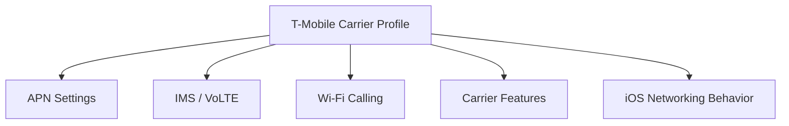
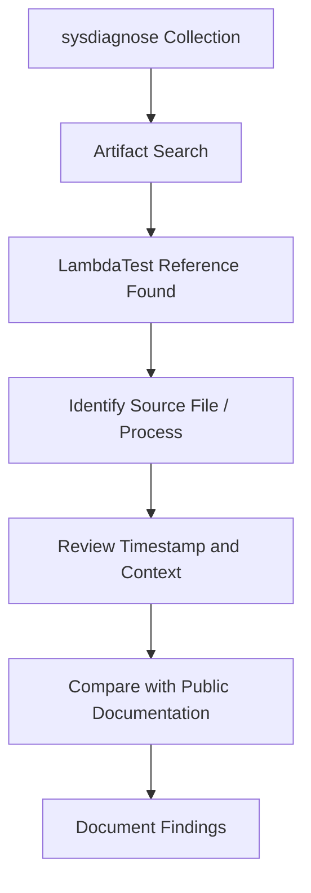
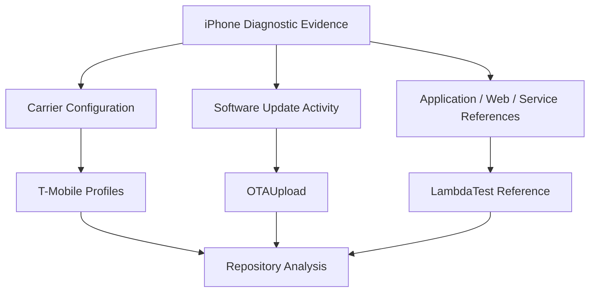

# 📱 iOS-System-Research

<p align="center">

**Research repository documenting observations from iOS diagnostic artifacts, carrier profiles, and system analysis.**


</p>

---

## Overview

**iOS-System-Research** documents technical observations from iOS-related artifacts contained in this repository. The purpose is not to describe every part of iOS, but to explain the specific evidence collected here and place it in technical context.

The current repository focuses on:

- Two extracted **T-Mobile carrier profiles**
- **OTAUpload** artifacts identified during analysis
- References to **LambdaTest** found within a sysdiagnose collection
- Supporting screenshots, log excerpts, and research notes

The repository follows an evidence-first approach: direct observations are separated from interpretation so that findings can be reviewed and reproduced independently.

---

## Repository Workflow


---

# Investigation 1 — T-Mobile Carrier Profiles

## What is a carrier profile?

Carrier profiles, often implemented through Apple carrier bundles and related configuration data, allow iOS to apply settings associated with a mobile network operator.

Depending on the carrier and iOS version, carrier configuration can describe or influence areas such as:

- Access Point Name (**APN**) configuration
- IMS-related services
- Voice over LTE (**VoLTE**)
- Wi-Fi Calling
- MMS configuration
- Carrier feature flags
- Network capabilities
- Carrier branding and identifiers

These settings allow the same iOS operating system to adapt to the network requirements and supported features of different carriers.

## What the repository contains

This repository contains two extracted T-Mobile profiles for technical examination. They are preserved so their configuration can be compared and documented directly rather than inferred only from device behavior.

Analysis may include:

- Configuration keys
- Network identifiers
- APN-related entries
- IMS and voice-service settings
- Feature flags
- Differences between profile versions



A carrier profile should not automatically be treated as suspicious. Carrier-specific configuration is a normal component of cellular operation on iOS. The research value is in understanding exactly what the extracted profiles contain and how those values correspond to documented carrier and iOS behavior.

---

# Investigation 2 — OTAUpload

## What is OTAUpload?

**OTA** means **Over-the-Air**. In the iOS ecosystem, OTA mechanisms are used for software updates and related system-delivered assets without requiring the device to be physically connected to a computer.

Artifacts containing names such as `OTAUpload` can appear in update-related diagnostics and system activity. The exact meaning of a particular occurrence depends on the surrounding process names, subsystem, timestamps, parameters, and neighboring log entries.

In a forensic context, an OTAUpload reference may therefore be useful because it can help identify where update-related components appear in the diagnostic record.

Potentially relevant surrounding activity can include:

- Software update preparation
- Update services
- Asset handling
- Diagnostic reporting associated with updates
- Background system communication

The presence of the term **OTAUpload** by itself does **not** establish malicious or abnormal activity. It should be interpreted together with the surrounding evidence.

## What the repository documents

The OTAUpload material in this repository is intended to preserve and explain the observed evidence, including where available:

- Original log excerpts
- Timestamps
- Process or subsystem names
- Screenshots
- Neighboring log activity
- Technical notes


The goal is to answer a narrower question: **what does the artifact show, and how does it fit into known iOS update behavior?**

---

# Investigation 3 — LambdaTest References

## What is LambdaTest?

**LambdaTest** is a commercial cloud testing platform used by developers and organizations to test websites and applications across browsers, operating systems, and device environments.

Typical uses include:

- Browser compatibility testing
- Mobile application testing
- Automated test execution
- Continuous Integration / Continuous Delivery (**CI/CD**) workflows
- Remote device and browser testing

## What does a LambdaTest reference on an iPhone mean?

A reference to LambdaTest inside an iPhone diagnostic collection is an observation that requires context.

A string, hostname, URL, application reference, cached record, web artifact, SDK reference, or diagnostic entry can appear in a sysdiagnose for several possible reasons. The existence of the reference alone does **not** prove that LambdaTest was deliberately used by the device owner, that the iPhone itself was enrolled in a remote testing session, or that LambdaTest controlled the device.

Determining what happened requires examining surrounding evidence such as:

- The file containing the reference
- Process name
- Timestamp
- URL or hostname
- Bundle identifier
- Network activity
- Application context
- Nearby Unified Log entries

## What the repository documents

This repository preserves the LambdaTest-related references discovered during sysdiagnose analysis so the evidence can be examined independently.



The important distinction is between **finding a LambdaTest reference** and **proving a particular LambdaTest activity occurred**. The repository documents the former and evaluates the available evidence for the latter.

---

# How the Three Artifact Groups Relate

Although these artifacts come from different parts of the system, they can all appear during analysis of an iPhone because sysdiagnose and related diagnostic sources expose information from many independent subsystems.



They should not be assumed to represent a single common process merely because they exist in the same research repository. Each artifact is analyzed according to its own source and context.

---

# Evidence Classification

The repository uses a simple evidence model to prevent observation and interpretation from being conflated.

| Category | Meaning |
|---|---|
| **Direct Observation** | Information visible directly in the collected artifact |
| **Documented Behavior** | Behavior supported by Apple, carrier, vendor, standards, or other authoritative documentation |
| **Correlated Evidence** | An interpretation supported by multiple independent artifacts or sources |
| **Working Hypothesis** | A technically plausible explanation that still requires validation |
| **Open Question** | An observation for which the available evidence is not yet sufficient |

This distinction is especially important for sysdiagnose research because diagnostic collections can contain large amounts of historical, cached, application-generated, networking, and system-generated information.

---

# Repository Structure

The exact layout may evolve as the research is organized, but the repository centers on the following artifact groups:

```text
iOS-System-Research/
├── T-Mobile / Carrier Profile Research
├── OTAUpload Research
├── LambdaTest / Sysdiagnose Research
├── Supporting Screenshots and Log Excerpts
└── README.md
```

---

# Research Method

For each artifact, the analysis follows the same general sequence:

1. Preserve the original artifact.
2. Identify the file, profile, log, or diagnostic source.
3. Extract relevant strings and configuration values.
4. Record timestamps and process context where available.
5. Compare observations against public technical documentation.
6. Separate confirmed observations from hypotheses.
7. Preserve screenshots or excerpts that allow others to verify the finding.

This makes the repository useful not only as a collection of findings, but as a reproducible record of how those findings were reached.

---

# Important Interpretation Note

Diagnostic evidence should be interpreted conservatively.

For example:

- A **T-Mobile profile** demonstrates carrier configuration; it does not by itself demonstrate unauthorized carrier activity.
- An **OTAUpload** reference demonstrates that an OTA-related artifact exists in the analyzed data; additional context is needed to determine the specific operation.
- A **LambdaTest** reference demonstrates that LambdaTest-related information appeared in the sysdiagnose; it does not by itself establish remote device control or deliberate use of the service.

The repository is intended to preserve those distinctions while allowing deeper technical investigation of each artifact.

---

# References

Useful reference categories for interpreting the repository include:

- Apple Platform Security documentation
- Apple Developer documentation
- Apple Open Source / Darwin materials
- Apple device-management and configuration-profile documentation
- Carrier and cellular networking documentation
- 3GPP specifications for IMS and cellular services
- LambdaTest public documentation

---

# Purpose

The purpose of **iOS-System-Research** is to turn isolated diagnostic findings into organized, reviewable technical documentation.

The project is centered on the artifacts contained in this repository: **T-Mobile carrier profiles, OTAUpload-related evidence, and LambdaTest references discovered during sysdiagnose analysis**.

As additional evidence is added, conclusions should continue to be tied to the underlying artifacts rather than assumed from names or isolated strings alone.

---

# License

Unless otherwise noted, repository content is provided under the MIT License.
