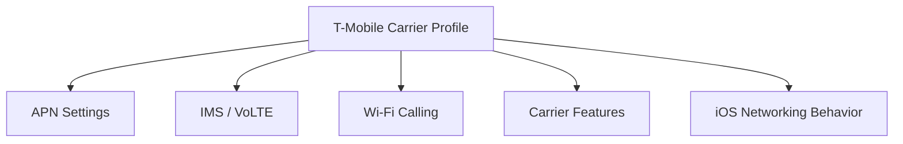
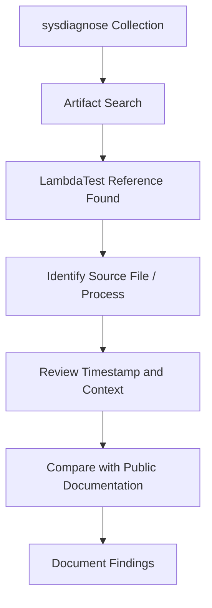
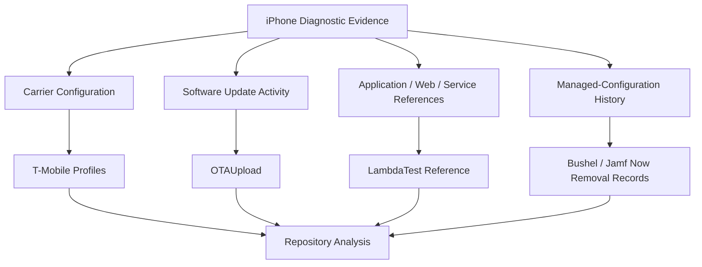

# 📱 iOS-System-Research

<p align="center">

**Research repository documenting observations from iOS diagnostic artifacts, carrier profiles, and system analysis.**


</p>

---

## Overview

**iOS-System-Research** documents technical observations from iOS-related artifacts contained in this repository. The purpose is not to describe every part of iOS, but to explain the specific evidence collected here and place it in technical context.

The current repository focuses on:

- Extracted **T-Mobile Wi-Fi / Passpoint profile artifacts**
- An extracted **AT&T Wi-Fi profile**
- **OTAUpload** artifacts identified during analysis
- References to **LambdaTest** found within a sysdiagnose collection
- Managed-configuration history in `ConfigurationProfiles/MCSettingsEvents.plist`
- Supporting screenshots, log excerpts, and research notes

The repository follows an evidence-first approach: direct observations are separated from interpretation so that findings can be reviewed and reproduced independently.

## iOS Developer Toolkit GUI

The repository now includes [iOS Developer Toolkit](IOSDeveloperToolkit/README.md), a Python/PySide6 macOS GUI for connected-device recognition, Developer Mode guidance, modern personalized DDI mounting, local Xcode DDI/Cryptex installation, `pymobiledevice3` command execution, Unified Logging and DVT collection, process and filesystem snapshots, and iOS PCAP capture. It preserves each run in a timestamped evidence folder with command results, scope limits, and SHA-256 hashes.

Run it from the repository root:

```bash
./script/build_and_run.sh
```

---

## Repository Workflow


---

# Investigation 1 — T-Mobile Carrier Profiles

## What is a carrier profile?

Carrier profiles, often implemented through Apple carrier bundles and related configuration data, allow iOS to apply settings associated with a mobile network operator.

Depending on the carrier and iOS version, carrier configuration can describe or influence areas such as:

- Access Point Name (**APN**) configuration
- IMS-related services
- Voice over LTE (**VoLTE**)
- Wi-Fi Calling
- MMS configuration
- Carrier feature flags
- Network capabilities
- Carrier branding and identifiers

These settings allow the same iOS operating system to adapt to the network requirements and supported features of different carriers.

## What the repository contains

This repository contains three T-Mobile profile artifacts for technical examination: two valid XML configuration profiles and one non-installable removal-stub export. They are preserved so their configuration can be compared and documented directly rather than inferred only from device behavior.

Analysis may include:

- Configuration keys
- Network identifiers
- APN-related entries
- IMS and voice-service settings
- Feature flags
- Differences between profile versions



A carrier profile should not automatically be treated as suspicious. Carrier-specific configuration is a normal component of cellular operation on iOS. The research value is in understanding exactly what the extracted profiles contain and how those values correspond to documented carrier and iOS behavior.

---

# Investigation 2 — OTAUpload

## What is OTAUpload?

**OTA** means **Over-the-Air**. In the iOS ecosystem, OTA mechanisms are used for software updates and related system-delivered assets without requiring the device to be physically connected to a computer.

Artifacts containing names such as `OTAUpload` can appear in update-related diagnostics and system activity. The exact meaning of a particular occurrence depends on the surrounding process names, subsystem, timestamps, parameters, and neighboring log entries.

In a forensic context, an OTAUpload reference may therefore be useful because it can help identify where update-related components appear in the diagnostic record.

Potentially relevant surrounding activity can include:

- Software update preparation
- Update services
- Asset handling
- Diagnostic reporting associated with updates
- Background system communication

The presence of the term **OTAUpload** by itself does **not** establish malicious or abnormal activity. It should be interpreted together with the surrounding evidence.

## What the repository documents

The OTAUpload material in this repository is intended to preserve and explain the observed evidence, including where available:

- Original log excerpts
- Timestamps
- Process or subsystem names
- Screenshots
- Neighboring log activity
- Technical notes


The goal is to answer a narrower question: **what does the artifact show, and how does it fit into known iOS update behavior?**

---

# Investigation 3 — LambdaTest References

## What is LambdaTest?

**LambdaTest** is a commercial cloud testing platform used by developers and organizations to test websites and applications across browsers, operating systems, and device environments.

Typical uses include:

- Browser compatibility testing
- Mobile application testing
- Automated test execution
- Continuous Integration / Continuous Delivery (**CI/CD**) workflows
- Remote device and browser testing

## What does a LambdaTest reference on an iPhone mean?

A reference to LambdaTest inside an iPhone diagnostic collection is an observation that requires context.

A string, hostname, URL, application reference, cached record, web artifact, SDK reference, or diagnostic entry can appear in a sysdiagnose for several possible reasons. The existence of the reference alone does **not** prove that LambdaTest was deliberately used by the device owner, that the iPhone itself was enrolled in a remote testing session, or that LambdaTest controlled the device.

Determining what happened requires examining surrounding evidence such as:

- The file containing the reference
- Process name
- Timestamp
- URL or hostname
- Bundle identifier
- Network activity
- Application context
- Nearby Unified Log entries

## What the repository documents

This repository preserves the LambdaTest-related references discovered during sysdiagnose analysis so the evidence can be examined independently.



The important distinction is between **finding a LambdaTest reference** and **proving a particular LambdaTest activity occurred**. The repository documents the former and evaluates the available evidence for the latter.

---

# Investigation 4 — Unexpected Bushel / Jamf Now Records

## Owner-reported device history and concern

The owner reports that this was a personally owned iPhone that was never knowingly enrolled in mobile device management (**MDM**) and was never an education, government, employer, or other institutionally managed device. The owner also reports never knowingly installing, approving, or using Bushel or Jamf Now.

Under that reported history, the Bushel-specific records in [`ConfigurationProfiles/MCSettingsEvents.plist`](ConfigurationProfiles/MCSettingsEvents.plist) should not have been present. They are highly unexpected and reasonably concerning. These are not generic Apple identifiers that would be expected merely because a phone runs iOS: Jamf's own support documentation associates `com.bushel.encrypted-profile-service` with a Jamf Now enrollment profile installed through Open Enrollment.

The owner's position is therefore straightforward: **a Bushel / Jamf Now profile source should never have entered this personal device's managed-configuration history without the owner's knowledge and authorization.** The artifact warrants a serious provenance investigation rather than dismissal as a harmless string match.

The reported ownership and enrollment history is important context supplied by the owner. It is not independently established by this plist, so the artifact findings and the owner's account are recorded separately.

## Full-file findings

The plist contains retained settings-event state rather than a list of only Bushel-related data. A complete structural review found:

| Observation | Result |
|---|---|
| Top-level sections | `EffectiveSettings`, `Restrictions`, `SystemClientRestrictions`, `SystemProfileRestrictions`, and `SystemSettings` |
| Event records | 337 total: 310 `set` and 27 `remove` |
| Recorded UTC range | 2020-10-30 through 2023-08-11 |
| System profile-source buckets | 58 total |
| Non-empty system profile-source buckets | Only `com.bushel.encrypted-profile-service` and `com.bushel.webclip`; the other 56 contain empty restriction maps |
| Directly Bushel-attributed records | 10, all `remove` events at `2022-06-20T07:52:41Z` |

The two product-specific sources are:

- `com.bushel.encrypted-profile-service-ce5b78c6-3df9-43bb-ac66-7ce2a711faa9`
- `com.bushel.webclip-34e6d242-5487-4996-a91a-ef88bec245f7`

Both sources record removal of the same two restriction keys:

- `cloudBackupPasswordRequired`
- `forceEncryptedBackup`

Within `SystemProfileRestrictions`, each Bushel source has both `preference` and `value` removal records for both restriction keys. The `Restrictions` section also has two removal records attributed to the Bushel web-clip source. At the same timestamp, `EffectiveSettings` records removal of the two resulting effective settings by `MCRestrictionManagerWriter.RecomputeEffectiveUserSettings`. This produces 12 related removal records at that timestamp: 10 directly attributed to the Bushel sources and two effective-settings recomputations.

## What the removal records establish

The word `remove` does not make the identifiers irrelevant. It records that iOS removed managed restrictions attributed to those uniquely named sources. It is therefore reasonable to infer that the Bushel-named profile sources had previously been represented in the device's managed-configuration state; a source cannot meaningfully be removed from that state without having first entered it or been carried into it as retained state.

The coordinated timestamp, source-specific UUID suffixes, matching settings, and effective-settings recomputation make this more than an isolated occurrence of the word “Bushel.” Official Jamf documentation further ties the exact base identifier to Jamf Now Open Enrollment.

For a device with the owner-reported history above, that prior presence is the central concern. It is not expected consumer iOS behavior and requires an explanation.

## What remains unproven

This plist preserves the removal side of the history but contains no corresponding Bushel `set` event. It does not identify:

- The date the Bushel sources first entered managed-configuration state
- The person or organization responsible
- The displayed profile or organization name presented to the user
- Whether enrollment was completed directly through Jamf Now, through another branded service using the same infrastructure, or carried through a restore or migration
- Whether an MDM enrollment was still active when the sysdiagnose was collected
- Whether the owner saw or approved an enrollment prompt

The absence of a retained `set` event does not negate prior presence; it means this file alone does not preserve the installation event. Conversely, the removal records alone cannot establish covert enrollment or identify an actor. Those conclusions require correlated evidence.

## How could it have reached a never-managed personal phone?

Apple describes three main device-management enrollment families: account-driven enrollment, profile-based Device Enrollment, and Automated Device Enrollment. Apple also states that when a configuration profile is delivered by email or a webpage, the iPhone asks the user for permission to install it and displays information about its contents. None of these is a routine background consequence of owning or normally using a consumer iPhone.

An ordinary App Store app, carrier connection, website visit, or Apple Account sign-in does not explain a Jamf-specific profile source silently appearing in managed-configuration state. A webpage or message can deliver a profile file, but the normal manual installation path still requires the iOS profile-installation flow. An MDM service can push later profiles only after an enrollment relationship has already been established.

If the owner's report rules out knowingly using Open Enrollment, all other MDM enrollment, education or employer management, restore or migration, setup assistance, and previous ownership, the remaining explanations are narrower:

1. An enrollment or profile installation occurred without the owner recognizing what it was, including installation under another displayed organization or product name.
2. Another person with physical and passcode access completed the profile-installation flow.
3. The device was incorrectly assigned to an organization through Automated Device Enrollment or was prepared through Apple Configurator. These paths ordinarily leave additional setup, supervision, or enrollment evidence that should be sought.
4. The plist reflects stale or anomalous managed-configuration cleanup rather than a complete successful MDM session. This could explain incomplete history, but no evidence in this file identifies an Apple bug or a benign reason for the exact Jamf-associated source names.
5. The artifact's provenance is wrong or incomplete—for example, the file came from a different device, a mixed diagnostic collection, or an edited/exported copy. The repository copy alone is not cryptographic proof of which phone generated it.
6. An unauthorized enrollment or profile installation occurred. This is a legitimate working hypothesis after normal paths are excluded, but identifying it as covert MDM requires evidence of the original installation, management server, enrollment identity, or actor.

There is no supported “spontaneous default iOS data” explanation in the reviewed evidence. If the file is authentic to this phone and all legitimate enrollment paths are excluded, the unexplained prior placement is abnormal and the authorization question remains open.

## Public comparison search

An exact-string public search performed on 2026-08-23 found no directly comparable report from a private iPhone owner who showed these same identifiers while also reporting no Jamf, Bushel, MDM, school, employer, or institutional relationship.

- The exact query `"com.bushel.encrypted-profile-service"` returned Jamf's own removal documentation but no matching private-owner account.
- Exact searches for `"com.bushel.webclip"`, the enrollment identifier with `iPhone`, `Reddit`, or `never`, and `"MCSettingsEvents.plist" "bushel"` returned no matching report.
- Searches of a public Reddit archive for the exact identifier, `encrypted-profile-service`, and `MCSettingsEvents.plist` returned no matching post.

This negative search result means the condition is publicly uncommon or poorly documented in the sources checked; it does not prove that no other case has ever occurred. Search engines cannot expose private vendor tickets, unindexed sysdiagnoses, deleted posts, or cases where the owner never extracted this file. No population-level dataset was found from which a defensible occurrence rate could be calculated.

Within that scope, this repository currently documents the only exact private-iOS example located during the review. The lack of comparable reports makes the artifact more unusual, not more conclusive about who caused it.

The terms containing `encrypted` also need precise interpretation. `com.bushel.encrypted-profile-service` is a product-associated identifier, while `forceEncryptedBackup` is the name of an Apple restriction key. These strings do not by themselves prove malware, hidden encrypted content, data exfiltration, or that Jamf encrypted the owner's data.

## Evidence needed to resolve provenance

The strongest next evidence would be:

1. The complete original sysdiagnose, including the full `logs/MCState` directory and file hashes.
2. Profile and managed-configuration Unified Log entries around `2022-06-20T07:52:41Z`.
3. Any retained profile manifests, enrollment receipts, configuration-profile files, backup records, or restore/migration history.
4. The device's current **Settings → General → VPN & Device Management** state, recorded separately because current state cannot reconstruct all historical enrollment.
5. Purchase, activation, repair, setup-assistance, employer, carrier, or prior-ownership records that could supply an enrollment path.

Until that evidence is correlated, the defensible conclusion is: **the plist records prior Bushel / Jamf Now-associated configuration state being removed, that state is highly unexpected under the owner's reported history, and the mechanism and authorization of its original placement remain unresolved.**

---

# Investigation 5 — Carrier Wi-Fi Profiles and Evil-Twin Exposure

## Scope and artifact validity

This is a defensive threat assessment, not a claim that an evil-twin attack occurred. A profile can make a device *eligible* to discover or automatically join a network; that is different from proving successful authentication, traffic interception, code execution, or device compromise.

All four carrier-profile artifacts were reviewed. Two are valid, unsigned XML property lists. Two are textual removal-stub exports in `plutil -p`-style notation and cannot be installed as supplied:

| Artifact | Parse/install state | SHA-256 | Material finding |
|---|---|---|---|
| [`AT&T Profiles/attwifi.mobileconfig`](AT&T%20Profiles/attwifi.mobileconfig) | Invalid plist; `MCProfileIsRemovalStub = 1`; `ProfileWasEncrypted = 0` | `336004f50107df9cd7724639ffdeb2437e3c46e30643a56bf4725b4cfa32498b` | Historical open-SSID auto-join configuration, not Passpoint |
| [`TMobile Profiles/TMobile.us.mobileconfig`](TMobile%20Profiles/TMobile.us.mobileconfig) | Valid, plain unsigned XML | `7cafab12c33bb8c31a7e5647f9d7a4d7950e03b0939ba8a0f5700018ce5ee05d` | Contains one carrier-roaming EAP-AKA payload and one `TMobileWingman` EAP-AKA payload |
| [`TMobile Profiles/TMobileWingman.mobileconfig`](TMobile%20Profiles/TMobileWingman.mobileconfig) | Invalid plist; `MCProfileIsRemovalStub = true`; `ProfileWasEncrypted = false` | `4c9b15d674070e0e3afb61bae67740f5d277c00bc65a0071a04c157690075e88` | Historical export of the same two T-Mobile payloads |
| [`TMobile Profiles/profile.mobileconfig`](TMobile%20Profiles/profile.mobileconfig) | Valid, plain unsigned XML | `d0aa4055c5461776925be3861d40241586890d462514d7f53b971f24135a600b` | Passpoint profile selected by `t-mobile.com`, MCC/MNC `310260`, and a 3GPP NAI realm |

“Unsigned” means the XML files have no cryptographic CMS wrapper authenticating who produced them. Names such as `Apple Inc`, `T-Mobile`, and identifiers beginning with `com.apple` are strings that can be copied; they are not signatures. “Removal stub” means historical configuration state, not a currently installable profile.

## Payload-by-payload findings

| Payload | Automatic selection | Authentication and privacy | Evil-twin relevance |
|---|---|---|---|
| `attwifi` | `AutoJoin = 1`, literal SSID `attwifi` | `EncryptionType = None`; no EAP; `IsHotspot = 0`; roaming disabled | If an equivalent profile or remembered network were active, a nearby AP copying the SSID could attract an automatic open-network association. This repository file itself cannot cause that because it is not an installable plist. |
| T-Mobile carrier-roaming payload | `AutoJoin = true`; hotspot enabled; MCC/MNC `310260`; NAI realm `wlan.mnc260.mcc310.3gppnetwork.org`; roaming enabled | WPA2; EAP type `23` (EAP-AKA); encrypted SIM/AKA identity explicitly enabled | A fake Hotspot 2.0 network can advertise matching discovery data and provoke an authentication attempt. It still needs a legitimate carrier/roaming AAA path, stolen operator secrets, or a separate implementation failure to complete EAP-AKA as the network. |
| `TMobileWingman` | `AutoJoin = true`; hidden SSID `TMobileWingman`; hotspot enabled; roaming disabled | `EncryptionType = Any`; EAP-AKA; the encrypted-identity key is absent | Copying the hidden SSID can provoke an association/authentication attempt if the payload is active. `Any` broadens the accepted Wi-Fi security type. Absence of the encrypted-identity key warrants privacy review but does not by itself prove that iOS transmitted an IMSI in cleartext. |
| `T-Mobile Passpoint Secure` | `AutoJoin = true`; no fixed SSID; domain `t-mobile.com`; MCC/MNC `310260`; same NAI realm; roaming enabled | WPA2; EAP-AKA | This is the clearest Passpoint artifact. Matching ANQP/Hotspot 2.0 advertisements may make the device consider the network, but those advertisements are selectors rather than proof that the network possesses T-Mobile authentication authority. |

IANA assigns EAP method number `23` to EAP-AKA. RFC 4187 documents mutual authentication, integrity, replay protection, and 128-bit key derivation. This blocks the simple version of the attack in which a fake AP merely copies a name and pretends to be the carrier's EAP server.

The protection is not absolute. RFC 4187 also states that EAP-AKA authenticates the EAP server, not necessarily a distinct Wi-Fi authenticator, and does not provide channel binding to that access point. A rogue authenticator may therefore trigger or relay an exchange, cause denial of service, observe association behavior, or test identity-privacy behavior. The RFC specifically warns that an active network impersonator may request the permanent subscriber identity when a usable pseudonym is unavailable; the client can refuse under some conditions. This makes the encrypted-identity setting relevant, but the plist alone cannot establish what identity an actual iOS build sent.

## What a successful evil-twin compromise would require

A defensible attack chain has several separate gates:

1. A valid matching profile or remembered network must actually be present on the device. The two removal stubs do not satisfy this condition.
2. The fake AP must win network selection by matching the SSID or the Passpoint discovery attributes and presenting a usable signal.
3. For `attwifi`, the open-network association may succeed without Wi-Fi authentication. For the T-Mobile payloads, EAP-AKA authentication must still complete or be relayed through an authorized backend.
4. Network control is not automatically device compromise. The attacker would still need unencrypted application traffic, a successful malicious captive page, invalid TLS handling, an installed rogue root certificate, a vulnerable app or OS service, or another exploit. Correct HTTPS certificate validation continues to protect application content from a local rogue AP.

NIST classifies public unencrypted Wi-Fi as exposed to rogue-access-point man-in-the-middle attacks. That general threat maps most directly to the historical `attwifi` payload. The T-Mobile profiles have a different risk profile: discovery and identity exposure are plausible concerns, while authenticated traffic interception requires more than copied Passpoint settings.

No reviewed carrier artifact contains a certificate payload, a certificate-anchor UUID, a trusted-server-name override, or an active manual/PAC proxy. Accordingly, these files do **not** show a rogue CA or interception proxy being installed. A modified mobileconfig *could* add those elements, but that would be a different profile and would need its own installation or MDM delivery path.

## Relationship to the Bushel / Jamf Now records

The Bushel records and carrier Wi-Fi artifacts are separate evidence sets. An enrolled MDM service can deliver managed Wi-Fi payloads, so unauthorized management would be a technically possible distribution path for a maliciously modified auto-join, proxy, certificate, or Passpoint profile. Nothing currently preserved links these carrier profile UUIDs to the two Bushel source UUIDs, identifies Jamf as their distributor, or proves that either valid XML profile was installed on this phone.

The word `encrypted` must also remain scoped correctly:

- `com.bushel.encrypted-profile-service` is a Jamf Now-associated identifier, not proof that the carrier profiles or the phone's data were secretly encrypted.
- `forceEncryptedBackup` is an Apple restriction key removed from the Bushel-attributed state.
- The two removal-stub exports explicitly state `ProfileWasEncrypted = false`.
- Wi-Fi link encryption (`None`, `WPA2`, or `Any`) is a separate property from configuration-profile encryption and backup encryption.

The concerning combined hypothesis is therefore conditional: **if unauthorized MDM control existed, it could have been used to distribute a hostile network profile; the current artifacts establish neither that delivery nor an evil-twin connection.**

## Read-only audit code

The following commands validate each file before parsing it, preserve invalid exports as evidence, calculate hashes, and print security-relevant keys. They do not install, decrypt, modify, or transmit a profile.

```zsh
profiles=(
  "AT&T Profiles/attwifi.mobileconfig"
  "TMobile Profiles/TMobile.us.mobileconfig"
  "TMobile Profiles/TMobileWingman.mobileconfig"
  "TMobile Profiles/profile.mobileconfig"
)

for profile in "${profiles[@]}"; do
  shasum -a 256 "$profile"

  if ! plutil -lint "$profile"; then
    printf 'ERROR: %s is not an installable plist; inspect it only as a textual export.\n' "$profile" >&2
    continue
  fi

  plutil -p "$profile" | rg \
    'PayloadType|PayloadIdentifier|SSID_STR|AutoJoin|EncryptionType|HIDDEN_NETWORK|IsHotspot|DomainName|MCCAndMNCs|NAIRealmNames|RoamingConsortiumOIs|ServiceProviderRoamingEnabled|AcceptEAPTypes|EAPSIMAKAEncryptedIdentityEnabled|TLSTrustedServerNames|PayloadCertificateAnchorUUID|ProxyType|ProxyServer|ProxyPACURL'
done
```

For any newly obtained profile, preserve the original and hash first. Treat these additions as high-risk review points: certificate payloads, `PayloadCertificateAnchorUUID`, proxy or PAC settings, credentials, weakened EAP choices, unexpected `AutoJoin`, `EncryptionType = None` or `Any`, and Passpoint selectors unrelated to the claimed provider. Static review identifies configuration risk; it does not prove the profile was installed or used.

---

# How the Four Artifact Groups Relate

Although these artifacts come from different parts of the system, they can all appear during analysis of an iPhone because sysdiagnose and related diagnostic sources expose information from many independent subsystems.



They should not be assumed to represent a single common process merely because they exist in the same research repository. Each artifact is analyzed according to its own source and context.

---

# Evidence Classification

The repository uses a simple evidence model to prevent observation and interpretation from being conflated.

| Category | Meaning |
|---|---|
| **Direct Observation** | Information visible directly in the collected artifact |
| **Documented Behavior** | Behavior supported by Apple, carrier, vendor, standards, or other authoritative documentation |
| **Correlated Evidence** | An interpretation supported by multiple independent artifacts or sources |
| **Working Hypothesis** | A technically plausible explanation that still requires validation |
| **Open Question** | An observation for which the available evidence is not yet sufficient |

This distinction is especially important for sysdiagnose research because diagnostic collections can contain large amounts of historical, cached, application-generated, networking, and system-generated information.

---

# Repository Structure

The exact layout may evolve as the research is organized, but the repository centers on the following artifact groups:

```text
iOS-System-Research/
├── AT&T Profiles/
├── ConfigurationProfiles/
│   └── MCSettingsEvents.plist
├── LambdaTest/
├── OTAUPLOAD/
├── TMobile Profiles/
└── README.md
```

---

# Research Method

For each artifact, the analysis follows the same general sequence:

1. Preserve the original artifact.
2. Identify the file, profile, log, or diagnostic source.
3. Extract relevant strings and configuration values.
4. Record timestamps and process context where available.
5. Compare observations against public technical documentation.
6. Separate confirmed observations from hypotheses.
7. Preserve screenshots or excerpts that allow others to verify the finding.

This makes the repository useful not only as a collection of findings, but as a reproducible record of how those findings were reached.

---

# Important Interpretation Note

Diagnostic evidence should be interpreted conservatively.

For example:

- A **T-Mobile profile** demonstrates carrier configuration; it does not by itself demonstrate unauthorized carrier activity.
- An **OTAUpload** reference demonstrates that an OTA-related artifact exists in the analyzed data; additional context is needed to determine the specific operation.
- A **LambdaTest** reference demonstrates that LambdaTest-related information appeared in the sysdiagnose; it does not by itself establish remote device control or deliberate use of the service.
- A **Bushel removal record** demonstrates that iOS removed settings attributed to a Bushel-named source and supports prior presence in managed-configuration state; it does not by itself identify who placed the source or prove covert MDM control.
- A **carrier Wi-Fi profile** can create automatic network-selection behavior, but it does not by itself prove that the profile was installed, that an evil twin was present, or that authentication and device compromise succeeded.

The repository is intended to preserve those distinctions while allowing deeper technical investigation of each artifact.

---

# References

Useful reference categories for interpreting the repository include:

- Apple Platform Security documentation
- Apple Developer documentation
- Apple Open Source / Darwin materials
- Apple device-management and configuration-profile documentation
- Carrier and cellular networking documentation
- 3GPP specifications for IMS and cellular services
- LambdaTest public documentation

Specific references for the Bushel / Jamf Now finding:

- [Repository artifact: `MCSettingsEvents.plist`](ConfigurationProfiles/MCSettingsEvents.plist)
- [Jamf Support: Use command line to remove Jamf Now enrollment profile installed by Open Enrollment](https://support.jamf.com/en/articles/11032084-use-command-line-to-remove-jamf-now-enrollment-profile-installed-by-open-enrollment) — documents `com.bushel.encrypted-profile-service` as the profile identifier.
- [Apple iPhone User Guide: Install or remove configuration profiles on iPhone](https://support.apple.com/guide/iphone/install-or-remove-configuration-profiles-iph6c493b19/ios) — states that the user is asked for permission to install a manually delivered profile and can review its contents.
- [Apple Platform Deployment: Enrollment methods for Apple devices](https://support.apple.com/guide/deployment/enrollment-methods-for-apple-devices-dep08f54fcf6/web) — describes account-driven, profile-based, and Automated Device Enrollment.

Specific references for the carrier Wi-Fi and evil-twin review:

- [Apple Platform Deployment: Wi-Fi device management settings](https://support.apple.com/guide/deployment/wi-fi-settings-dep168e876c9/web) — documents managed Wi-Fi payloads, automatic join, hidden networks, and proxy configuration.
- [Apple Platform Deployment: HotSpot 2.0 device management settings](https://support.apple.com/guide/deployment/hotspot-20-settings-depea26c29b9/web) — documents automatic Hotspot 2.0 selection using domain, roaming consortium, NAI realm, and MCC/MNC settings.
- [Apple Platform Deployment: EAP device management settings](https://support.apple.com/guide/deployment/eap-settings-dep5d180f86a/web) — identifies EAP-AKA as a supported Apple device-management method.
- [IANA Extensible Authentication Protocol registry](https://www.iana.org/assignments/eap-numbers/) — assigns method type `23` to EAP-AKA.
- [RFC 4187: EAP-AKA](https://www.rfc-editor.org/rfc/rfc4187) — specifies EAP-AKA authentication, identity privacy, mutual authentication, and the absence of authenticator channel binding.
- [NIST Mobile Threat Catalogue: Rogue Access Points](https://pages.nist.gov/mobile-threat-catalogue/lan-pan-threats/LPN-0.html) — describes the man-in-the-middle risk of public unencrypted access points.

---

# Purpose

The purpose of **iOS-System-Research** is to turn isolated diagnostic findings into organized, reviewable technical documentation.

The project is centered on the artifacts contained in this repository: **carrier profiles, OTAUpload-related evidence, LambdaTest references, and managed-configuration events discovered during sysdiagnose analysis**.

As additional evidence is added, conclusions should continue to be tied to the underlying artifacts rather than assumed from names or isolated strings alone.

---

# License

Unless otherwise noted, repository content is provided under the MIT License.
